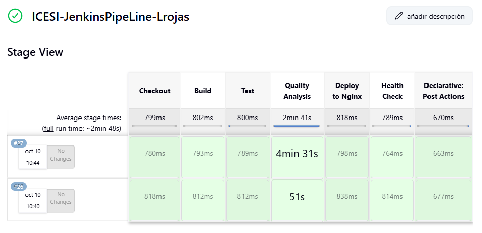

## Configuración de Jenkins para Ansible Pipeline

**Autor**: LUIS MANUEL ROJAS CORREA
**Código**: A00399289

**Colab**: RAFAELA SOFIA RUIZ PIZARRO
**Código**: A00395368

### 1. Acceso Inicial

- Acceder al servidor Jenkins: http://68.211.125.173
- Login con credenciales de administrador

### 2. Creación del Pipeline

1. **Crear Nuevo Job**:

   - Click en "New Item" en el dashboard de Jenkins
   - Seleccionar "Pipeline"
   - Nombre del proyecto: "ansible-pipeline"

2. **Configuración General**:

   - Descripción: "Pipeline para automatización con Ansible"
   - Marcar "GitHub project" y añadir URL del repositorio

3. **Configuración del Source Code Management**:

   ```groovy
   // Configuración Git
   Repository URL: https://github.com/Lrojas898/ansible-pipeline.git
   Branch Specifier: */main
   Script Path: Jenkinsfile
   ```

4. **Build Triggers**:
   - Seleccionar "Poll SCM"
   - Configurar schedule: `H/2 * * * *` (escaneo cada 2 minutos)

### 3. Configuración de Credenciales

1. **Credenciales SSH**:

   - Kind: Username with password
   - Username: adminuser
   - Password: DevOps2024!@#
   - ID: nginx-ssh-creds
   - Description: "Credenciales SSH para servidor Nginx"

2. **Token SonarQube**:
   - Kind: Secret text
   - Secret: sqa_461deb36c6a6df74233a1aa4b3ab01cd9714af56
   - ID: sonarqube-token
   - Description: "Token para análisis SonarQube"

### 4. Variables de Entorno Configuradas

```groovy
environment {
    SONAR_HOST_URL = 'http://68.211.125.173:9000'
    SONAR_TOKEN = credentials('sonarqube-token')
    NGINX_VM_IP = '68.211.125.160'
    NGINX_USER = 'adminuser'
    NGINX_PASSWORD = credentials('nginx-ssh-creds')
    WORKSPACE_APP = "/tmp/teclado-app-${BUILD_NUMBER}"
    DEPLOY_DIR = '/var/www/html'
    APP_VERSION = "v1.0.${BUILD_NUMBER}"
}
```

### 5. Visualización del Pipeline

El pipeline se ejecuta a través de las siguientes etapas, como se muestra en la imagen del Stage View de Jenkins:



Las etapas del pipeline incluyen:

- **Checkout**: Clonación del repositorio
- **Build**: Construcción del proyecto
- **Test**: Ejecución de pruebas
- **Quality Analysis**: Análisis de calidad con SonarQube
- **Deploy to Nginx**: Despliegue en el servidor Nginx
- **Health Check**: Verificación del despliegue
- **Declarative: Post Actions**: Acciones post-despliegue

Tiempos promedio de ejecución:

- Checkout: ~799ms
- Build: ~802ms
- Test: ~800ms
- Quality Analysis: ~2min 41s
- Deploy to Nginx: ~818ms
- Health Check: ~789ms
- Post Actions: ~670ms

### 6. Verificación de la Configuración

1. **Test de Conexión**:

   - Click en "Build Now"
   - Verificar "Console Output"
   - Confirmar clonación exitosa del repositorio

2. **Validación de Credenciales**:

   - Verificar acceso SSH al servidor Nginx
   - Confirmar conexión con SonarQube

3. **Monitoreo**:
   - Verificar el trigger automático cada 2 minutos
   - Revisar logs de ejecución en "Build History"

### 6. Ubicación del Jenkinsfile

El pipeline utiliza el Jenkinsfile ubicado en la raíz del repositorio:

```
ansible-pipeline/
└── Jenkinsfile
```

### 7. Resultados de la Configuración

- Pipeline configurado y funcional
- Integración con Git establecida
- Credenciales almacenadas de forma segura
- Build triggers configurados
- Variables de entorno definidas
